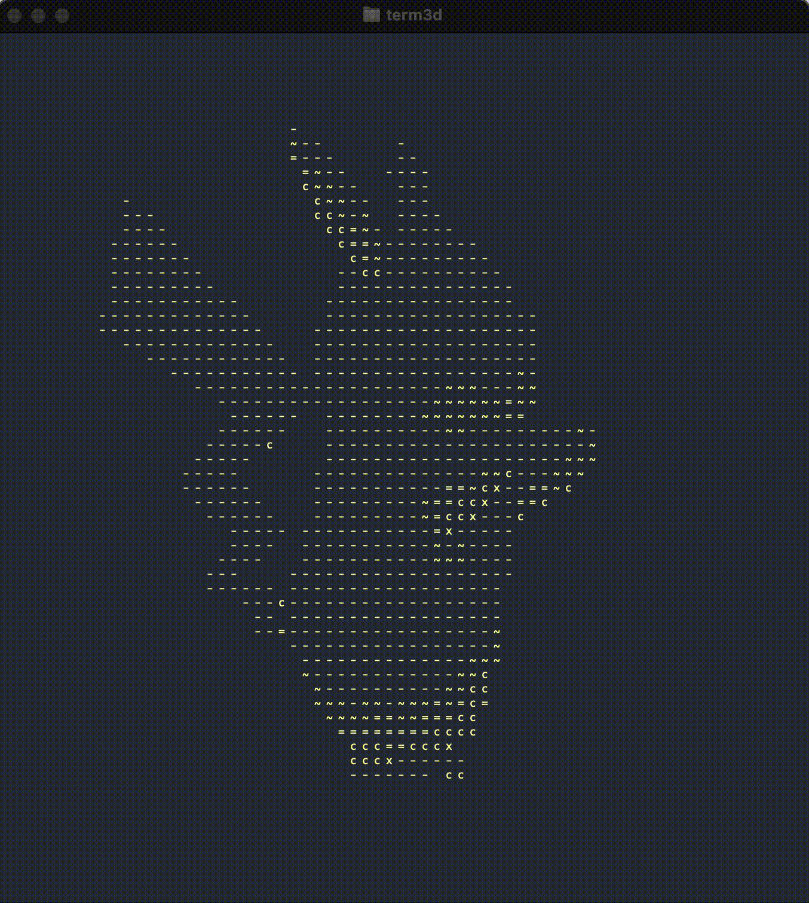

# Raytracer for terminal with ASCII for terminal





## Authors

- kohkubo
- yaito

## Control

```sh
=============================================================================
[Move Camera]   Up: w Down: s Left: a Right: d
[Rotate Camera] Up: i Down: k Left: j Right: l SppedUp: m SpeedDown: n
[Set Light]     Up: t Down: g Left: f Right: h Front: y Back: u
[Change Color]  Red: 1 Blue: 2 Green: 3 Yellow: 4 Magenta: 5 Cyan: 6 White: 7
[Zoom] In: z Out: x    [Pause/Resume] space    [Reset] r    [Quit] q
=============================================================================
```

## Features

- objファイルベースのポリゴン表示
- Raytracing
- Fongのモデルによる拡散と鏡面反射
- トーマス・モイラーの三角形の交差判定アルゴリズム
- pthreadsを用いたマルチスレッド
- 描画するASCII文字の指定
- カラー指定
  - BULE, RED, GREEN, YELLOW, BLUE, MAGENTA, CYAN, WHITE
- カメラ移動, 回転
    - 上下左右、回転軸の変更、回転の停止、回転速度、回転方向の
- 高速化により、ポリゴン数数千まで対応可能

## 開発Tools

- Google Test
- Google Benchmark
- CI with GitHub Actions
- Git Flowに準じたissue駆動開発
- カバレッジツールを使用した高速化処理
