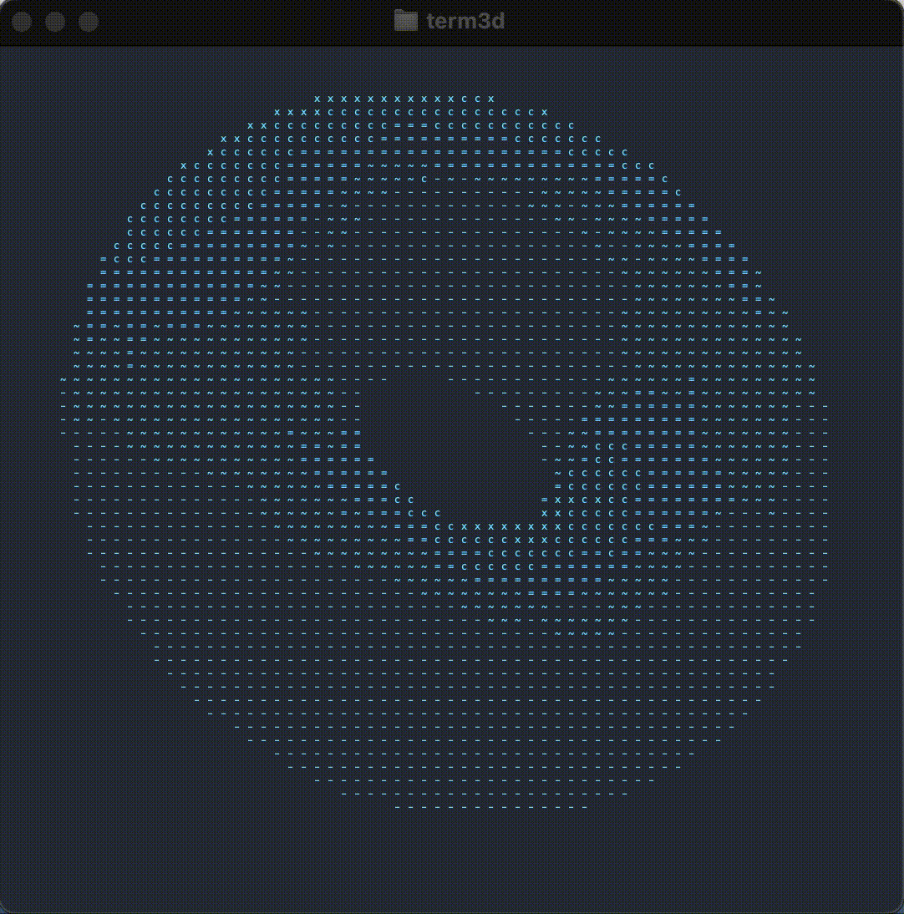

# Term3D

**Raytracer for terminal with ASCII for terminal**





## Authors

- kohkubo
- yaito

## Key control

```sh
=============================================================================
[Move Camera]   Up: w Down: s Left: a Right: d
[Rotate Camera] Up: i Down: k Left: j Right: l SppedUp: m SpeedDown: n
[Set Light]     Up: t Down: g Left: f Right: h Front: y Back: u
[Change Color]  Red: 1 Blue: 2 Green: 3 Yellow: 4 Magenta: 5 Cyan: 6 White: 7
[Zoom] In: z Out: x    [Pause/Resume] space    [Reset] r    [Quit] q
=============================================================================
```

## Features

- Raytracing
- Draws a polygon based on an obj file.
- Diffuse and specular reflections by Phong`s model
- Thomas Moyler's triangle crossing algorithm
- Multithread using pthreads
- Specify the ASCII characters to be drawn
- Optimized code (Capable of handling up to thousands of polygons)

## development Tools

- Google Test
- Google Benchmark
- CI with GitHub Actions
- Git Flow
- Coverage Tools
